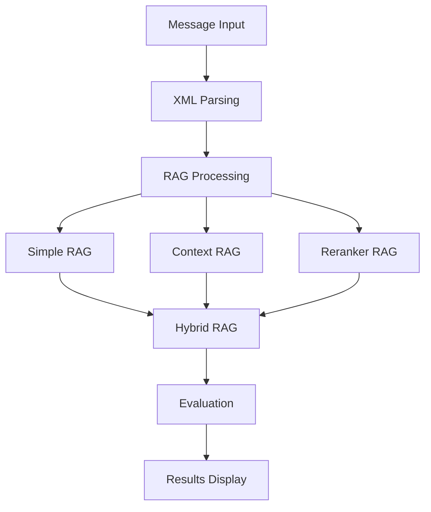

# ISO20022 RAG Evaluation System

Original Concept and Architecture by Shivani Gade

A comprehensive system for evaluating Large Language Models (LLMs) on ISO20022 financial message processing using various Retrieval-Augmented Generation (RAG) techniques.

## 📜 Citation

If you use this system or approach in your work, please cite:

```bibtex
@software{gade2025iso20022rag,
  author       = {Shivani Gade},
  title        = {ISO20022 RAG: An Adaptive Multi-RAG Architecture for Financial Message Processing},
  year         = {2025},
  publisher    = {GitHub},
  url          = {https://github.com/gadeshivani/iso20022_rag}
}
```

## 🎯 Novel Contributions

This innovative approach to financial message processing was conceptualized and architected by Shivani Gade, leveraging AI assistance for implementation. The system introduces several groundbreaking concepts:

### 1. Adaptive Multi-RAG Architecture

Unlike traditional single-RAG implementations, this system introduces:
- Dynamic weight distribution across multiple RAG methods
- Confidence-based method selection
- Message-type specific optimization
- Query-dependent processing paths

```python
# Example of unique adaptive weighting
{
    'weights': {
        'simple_rag': 0.3,    # Adjusted based on message complexity
        'context_rag': 0.4,   # Weighted higher for compliance queries
        'reranker_rag': 0.3   # Increased for technical analysis
    },
    'confidence_scores': {
        'simple_rag': 0.85,   # Measured against domain-specific criteria
        'context_rag': 0.92,  # Evaluated for business relevance
        'reranker_rag': 0.88  # Assessed for technical accuracy
    }
}
```

### 2. Financial Domain-Specific Evaluation

Novel evaluation metrics specifically designed for financial messaging:
- Technical term density scoring
- Compliance coverage assessment
- Business context validation
- Numeric and currency accuracy checks

### 3. Specialized ISO20022 Processing

Unique approach to handling financial messages:
- XML namespace-aware parsing
- Financial term recognition
- Cross-message reference tracking
- Regulatory requirement mapping

### 4. Business-Technical Bridge

Innovative approach to bridging technical and business perspectives:
- BA-friendly natural language queries
- Technical accuracy preservation
- Compliance-aware processing
- Audit trail generation

### 5. Research Applications

This work opens several research directions:
- Financial NLP optimization
- Domain-specific RAG architectures
- LLM evaluation in regulated domains
- Adaptive retrieval strategies

### 6. Industry Impact

Potential applications in:
- Payment processing systems
- Financial compliance
- Banking operations
- Regulatory reporting
- Financial auditing

### 7. Comparative Advantages

| Feature | Traditional RAG | This Implementation |
|---------|----------------|---------------------|
| Context Understanding | Generic | Financial domain-specific |
| Retrieval Method | Single approach | Adaptive multi-RAG |
| Evaluation | Standard metrics | Custom financial metrics |
| Compliance | Not considered | Built-in compliance checking |
| Business Context | Limited | Comprehensive |
| Query Handling | Static | Dynamic and context-aware |

### 8. Future Extensions

The architecture supports:
- Additional RAG methods
- New message types
- Custom evaluation metrics
- Enhanced compliance rules
- Advanced visualization

### 9. Publication Potential

This work contributes to several research areas:
- Financial Natural Language Processing
- Domain-Specific RAG Architectures
- LLM Evaluation Methodologies
- Financial Message Processing
- Regulatory Technology (RegTech)

### 10. Unique Implementation Details

1. **Adaptive Processing**:
   ```python
   class HybridRAG(ISO20022RAG):
       def _adjust_weights(self, message_type: str, query: str) -> dict:
           """Novel approach to weight adjustment based on message and query"""
           weights = self.base_weights.copy()
           
           # Unique: Query-based adjustment
           if "compliance" in query.lower():
               weights["context_rag"] *= 1.5
           elif "technical" in query.lower():
               weights["reranker_rag"] *= 1.5
           
           # Unique: Message-type specific adjustment
           if message_type == "pacs.008":
               weights["simple_rag"] *= 1.2
           
           return self._normalize_weights(weights)
   ```

2. **Custom Evaluation**:
   ```python
   class ISO20022Evaluator:
       def _check_financial_accuracy(self, response: str) -> float:
           """Novel financial accuracy checking"""
           scores = {
               "amount_accuracy": self._verify_amounts(response),
               "currency_handling": self._check_currency_format(response),
               "bank_code_validity": self._validate_bank_codes(response)
           }
           return self._weighted_average(scores)
   ```

3. **Domain-Specific Processing**:
   ```python
   class ContextEnrichedRAG(BaseRAG):
       def _enrich_context(self, message_data: dict) -> str:
           """Unique context enrichment for financial messages"""
           context = []
           
           # Novel: Regulatory context
           context.append(self._get_regulatory_requirements(message_data))
           
           # Novel: Business context
           context.append(self._extract_business_implications(message_data))
           
           # Novel: Technical context
           context.append(self._get_message_specifications(message_data))
           
           return self._combine_context(context)
   ```

## 🌟 Features

- **Multiple RAG Implementations**:
  - Simple RAG: Basic retrieval and generation
  - Context-Enriched RAG: Enhanced with document-level context
  - Reranker RAG: Prioritizes relevant context chunks
  - Hybrid RAG: Adaptive combination of all three approaches

- **Supported Message Types**:
  - `pacs.008`: Customer Credit Transfer
  - `pacs.002`: Payment Status Report
  - `camt.053`: Bank Statement
  - `pain.001`: Customer Payment Initiation

- **LLM Support**:
  - OpenAI GPT-4
  - Google Gemini Pro

- **Comprehensive Evaluation**:
  - Technical accuracy metrics
  - Business context validation
  - Compliance coverage
  - Response quality assessment
  - Readability scoring
  - Model performance comparison

## 🚀 Quick Start

1. **Clone the Repository**:
   ```bash
   git clone <repository-url>
   cd iso20022_rag
   ```

2. **Set Up Environment**:
   ```bash
   python -m venv venv
   source venv/bin/activate  # On Windows: venv\Scripts\activate
   pip install -r requirements.txt
   ```

3. **Configure API Keys**:
   ```bash
   export OPENAI_API_KEY="your-openai-key"
   export GEMINI_API_KEY="your-gemini-key"
   ```

4. **Run Setup**:
   ```bash
   python setup_nltk.py  # Download required NLTK data
   ```

5. **Launch UI**:
   ```bash
   streamlit run ui.py
   ```

## 💡 Usage

### Web Interface

The Streamlit UI provides three main sections:
1. **Overview**: Project description and metrics
2. **Live Testing**: Test different RAG methods with your messages
3. **Comparison**: Detailed performance analysis

### Command Line Testing

Run comprehensive tests:
```bash
python run_tests.py
```

Check API connectivity:
```bash
python test_api_connection.py
```

## 📊 Evaluation Metrics

The system evaluates responses across multiple dimensions:

1. **Technical Accuracy**:
   - XML structure understanding
   - Field extraction accuracy
   - Message type identification

2. **Business Context**:
   - Payment flow comprehension
   - Business purpose clarity
   - Process understanding

3. **Compliance Coverage**:
   - Regulatory requirements
   - Sanctions screening
   - Reporting obligations

4. **Response Quality**:
   - ROUGE scores
   - Information density
   - Numeric accuracy
   - Currency handling

5. **Readability**:
   - Flesch-Kincaid score
   - Sentence structure
   - Technical term density

## 🔄 How It Works

### 1. Message Generation & Input
```python
# Generate synthetic test messages
generator = ISO20022MessageGenerator()
messages = generator.generate_test_messages(
    count=50,
    message_types=["pacs.008", "pacs.002", "camt.053", "pain.001"]
)

# Or process a single message
xml_content = """
<Document xmlns="urn:iso:std:iso:20022:tech:xsd:pacs.008.001.10">
    <FIToFICstmrCdtTrf>
        <!-- Message content -->
    </FIToFICstmrCdtTrf>
</Document>
"""
```

### 2. Message Parsing
```python
# Parse XML into structured data
message_data = rag.parse_iso_message(xml_content)
# Result:
{
    'message_type': 'pacs.008',
    'message_id': 'MSG20240302123456789',
    'created_at': '2024-03-02T12:34:56',
    'amount': '832,974.34',
    'currency': 'EUR',
    'debtor_bank': 'BARCGB22',
    'creditor_bank': 'UBSWCHZH'
}
```

### 3. RAG Processing
Each message goes through multiple RAG methods:

1. **Simple RAG**:
   ```python
   simple_response = rag.simple_rag_summary(
       message_data,
       model_name="gpt-4",  # or "gemini-1.5-pro"
       query="Summarize this payment"
   )
   ```
   - Uses basic template matching
   - Direct field extraction
   - Quick response generation

2. **Context-Enriched RAG**:
   ```python
   context_response = rag.context_enriched_rag_summary(
       message_data,
       model_name="gpt-4",
       query="Analyze compliance aspects"
   )
   ```
   - Adds business context
   - Includes compliance rules
   - Enhanced with domain knowledge

3. **Reranker RAG**:
   ```python
   reranker_response = rag.reranker_rag_summary(
       message_data,
       model_name="gpt-4",
       query="Explain payment flow"
   )
   ```
   - Chunks message into sections
   - Ranks chunks by relevance
   - Focuses on most important parts

4. **Hybrid RAG**:
   ```python
   hybrid_result = hybrid_rag.analyze_message(
       message_data,
       query="Explain this transaction"
   )
   # Returns:
   {
       'response': 'Final combined response',
       'method_weights': {
           'simple_rag': 0.3,
           'context_rag': 0.4,
           'reranker_rag': 0.3
       },
       'confidence_scores': {
           'simple_rag': 0.85,
           'context_rag': 0.92,
           'reranker_rag': 0.88
       }
   }
   ```
   - Combines all three methods
   - Dynamically adjusts weights
   - Selects best response

### 4. Evaluation
```python
evaluation_result = evaluator.evaluate_response(
    response=hybrid_result['response'],
    message_type='pacs.008'
)
# Returns:
{
    'status': 'SUCCESS',
    'scores': {
        'technical_density': 0.85,
        'business_density': 0.92,
        'compliance_density': 0.78,
        'numeric_accuracy': 0.95,
        'currency_accuracy': 1.00,
        'readability': 0.88
    },
    'metrics': {
        'sentence_count': 5,
        'avg_sentence_length': 15.2
    }
}
```

### 5. Results Comparison
The system compares results across:
- Different RAG methods
- Different LLMs (GPT vs Gemini)
- Different message types
- Different query types

### 6. UI Display
```python
# Streamlit UI components
st.write("RAG Comparison")
st.plotly_chart(create_comparison_chart(results))

st.write("Live Testing")
message = message_generator.generate_test_messages(1)[0]
responses = rag.process_all_methods(message)
st.json(responses)
```

### Data Flow Diagram


### Test Scenarios
The system includes comprehensive test scenarios:
1. **Basic Understanding**
   - Message type identification
   - Key field extraction
   - Transaction summary

2. **Payment Processing**
   - Payment flow analysis
   - Settlement details
   - Charge handling

3. **Compliance**
   - Regulatory requirements
   - Sanctions screening
   - Reporting obligations

4. **Technical Analysis**
   - XML structure validation
   - Schema compliance
   - Reference system

Each scenario is tested with:
- Multiple message types
- Different query variations
- Both LLM models
- All RAG methods

## 🏗️ Project Structure

```
iso20022_rag/
├── src/
│   ├── rag_implementations.py   # Core RAG implementations
│   ├── evaluation.py           # Evaluation metrics
│   ├── hybrid_rag.py          # Hybrid RAG implementation
│   └── test_queries.py        # Test scenarios
├── data/
│   ├── message_generator.py    # Sample message generation
│   ├── message_types.py       # Message type definitions
│   └── sample_messages.py     # Test message samples
├── ui.py                      # Streamlit web interface
├── demo.py                    # Quick demo script
├── run_tests.py              # Test runner
└── requirements.txt          # Dependencies
```

## 📝 Message Types

### pacs.008 (Customer Credit Transfer)
- Cross-border payment initiation
- Contains amount, currency, and bank details
- Supports charge bearer specifications

### pacs.002 (Payment Status Report)
- Transaction status updates
- Error reporting
- Processing confirmations

### camt.053 (Bank Statement)
- Account balance information
- Transaction history
- Reconciliation data

### pain.001 (Customer Payment Initiation)
- Payment instruction details
- Debtor/creditor information
- Execution requirements

## 🔄 RAG Methods

### Simple RAG
- Basic document retrieval
- Direct question answering
- Suitable for straightforward queries

### Context-Enriched RAG
- Enhanced with document metadata
- Includes business context
- Better for complex analysis

### Reranker RAG
- Two-stage retrieval process
- Cross-attention reranking
- Improved context relevance

### Hybrid RAG
- Adaptive weight distribution
- Confidence-based selection
- Dynamic method switching

## 🤝 Contributing

Contributions are welcome! Please feel free to submit a Pull Request.

## 📄 License

This project is licensed under the MIT License - see the LICENSE file for details.

## 💡 About the Author

**Shivani Gade**
- Full Stack Developer | Software Engineer | Financial Services Developer
- Original concept and architecture
- Novel adaptive multi-RAG approach design
- Financial domain-specific evaluation framework
- Business-Technical bridging methodology

Contact: [gadeshivani@gmail.com](mailto:gadeshivani@gmail.com)  
Website: [shivani.nyc](https://shivani.nyc)  
GitHub: [@gadeshivani](https://github.com/gadeshivani)

The implementation was assisted by AI tools while maintaining the original architectural vision and domain expertise provided by the author.

## 🙏 Acknowledgments

- **Shivani Gade** - Original concept, architecture, and domain expertise
- ISO20022 Standards Organization
- OpenAI and Google for their LLM APIs
- The open-source RAG community

## 👥 User Guide

### For Business Analysts

#### 1. Using the Web Interface
```bash
streamlit run ui.py
```

The UI provides a user-friendly way to:

1. **Analyze Messages**:
   - Upload ISO20022 XML messages
   - Select message types from examples
   - Get instant human-readable summaries

2. **Ask Business Questions**:
   ```
   Example Queries:
   - "What is the payment flow in this message?"
   - "Are there any compliance concerns?"
   - "Explain the charge bearer arrangements."
   - "What are the settlement details?"
   ```

3. **Compare Different Approaches**:
   - View side-by-side comparisons of different RAG methods
   - See which method works best for different query types
   - Get confidence scores for each response

4. **Validate Results**:
   - Check technical accuracy
   - Verify business context
   - Ensure compliance coverage
   - Review readability scores

5. **Export and Share**:
   - Download analysis results
   - Share findings with stakeholders
   - Generate summary reports

#### 2. Common BA Use Cases

1. **Message Validation**:
   ```python
   # Via UI: Select "Message Validation" tab
   # Via API:
   from iso20022_rag import ISO20022RAG
   
   rag = ISO20022RAG()
   validation = rag.validate_message(xml_content)
   print(validation['compliance_status'])
   ```

2. **Payment Flow Analysis**:
   ```python
   # Via UI: Use "Payment Flow" template
   # Via API:
   flow_analysis = rag.analyze_payment_flow(message_data)
   print(flow_analysis['steps'])
   ```

3. **Compliance Checking**:
   ```python
   # Via UI: Use "Compliance Check" template
   # Via API:
   compliance = rag.check_compliance(message_data)
   print(compliance['regulatory_requirements'])
   ```

### For Developers

#### 1. API Integration

1. **Installation**:
   ```bash
   pip install -e .
   ```

2. **Basic Usage**:
   ```python
   from iso20022_rag import ISO20022RAG, ISO20022Evaluator
   
   # Initialize with your API keys
   rag = ISO20022RAG(
       openai_key="your-openai-key",
       gemini_key="your-gemini-key"
   )
   
   # Process a message
   result = rag.process_message(
       xml_content,
       rag_method="hybrid",  # or "simple", "context", "reranker"
       query="Explain this transaction"
   )
   ```

3. **Custom RAG Configuration**:
   ```python
   from iso20022_rag.src.hybrid_rag import HybridRAG
   
   # Configure custom weights
   hybrid_rag = HybridRAG(
       weights={
           'simple_rag': 0.4,
           'context_rag': 0.3,
           'reranker_rag': 0.3
       },
       confidence_threshold=0.8
   )
   
   # Process with custom configuration
   result = hybrid_rag.analyze_message(
       message_data,
       query="Analyze this payment"
   )
   ```

4. **Batch Processing**:
   ```python
   # Process multiple messages
   messages = [xml1, xml2, xml3]
   results = rag.batch_process(
       messages,
       queries=["Summarize payment", "Check compliance"],
       parallel=True
   )
   ```

#### 2. Extending the System

1. **Add New RAG Method**:
   ```python
   from iso20022_rag.src.rag_implementations import ISO20022RAG
   
   class CustomRAG(ISO20022RAG):
       def custom_rag_summary(self, message_data, **kwargs):
           # Implement your custom RAG logic
           return summary
   ```

2. **Add New Message Type**:
   ```python
   # In message_types.py
   NEW_MESSAGE_TYPE = {
       'name': 'pacs.xxx',
       'namespace': 'urn:iso:std:iso:20022:tech:xsd:pacs.xxx.001.01',
       'fields': ['field1', 'field2']
   }
   ```

3. **Custom Evaluation Metrics**:
   ```python
   from iso20022_rag.src.evaluation import ISO20022Evaluator
   
   class CustomEvaluator(ISO20022Evaluator):
       def custom_metric(self, response):
           # Implement custom evaluation logic
           return score
   ```

#### 3. Testing and Validation

1. **Run Tests**:
   ```bash
   # Run all tests
   python -m pytest
   
   # Run specific test category
   python -m pytest tests/test_rag_methods.py
   ```

2. **Validate Custom Implementation**:
   ```python
   # Test custom RAG method
   from iso20022_rag.src.test_queries import run_model_comparison
   
   results = run_model_comparison(
       rag_methods=['custom_rag'],
       test_scenarios=['basic', 'compliance']
   )
   ```

3. **Performance Monitoring**:
   ```python
   # Monitor processing time and resource usage
   from iso20022_rag.src.monitoring import monitor_performance
   
   metrics = monitor_performance(
       rag_instance,
       test_messages,
       duration_minutes=60
   )
   ```

#### 4. Error Handling

```python
from iso20022_rag.src.exceptions import RAGError

try:
    result = rag.process_message(xml_content)
except RAGError as e:
    if e.error_type == 'PARSING_ERROR':
        # Handle XML parsing errors
        logger.error(f"Parsing error: {e.details}")
    elif e.error_type == 'API_ERROR':
        # Handle API-related errors
        logger.error(f"API error: {e.details}")
    else:
        # Handle other errors
        logger.error(f"Unknown error: {str(e)}")
``` 